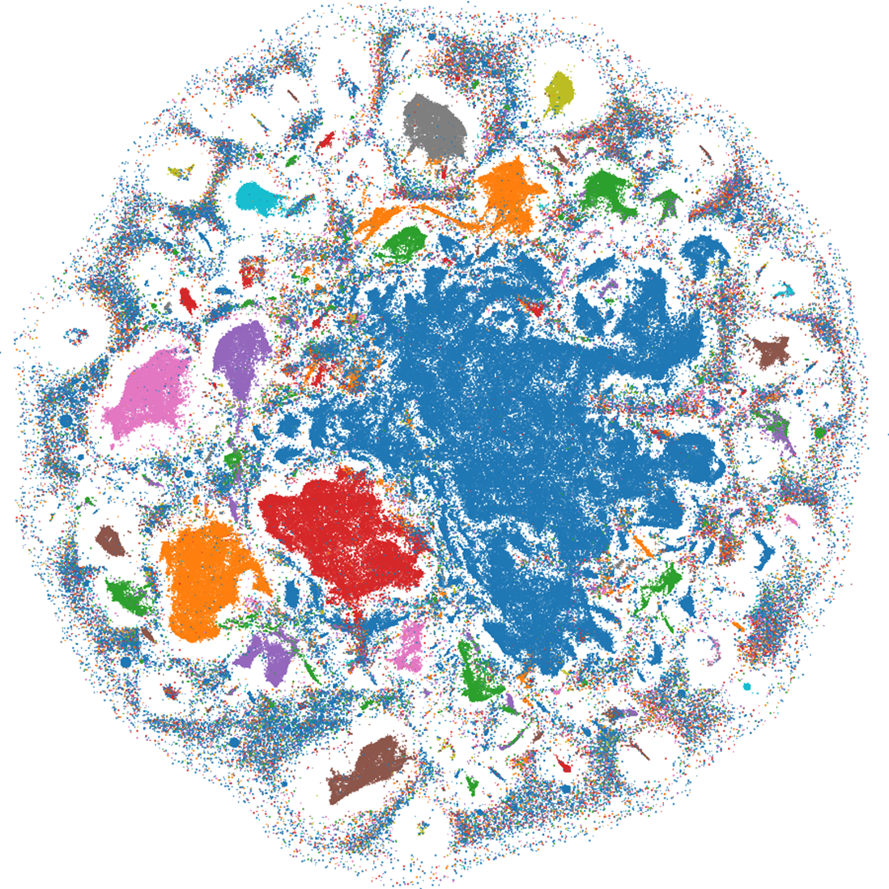
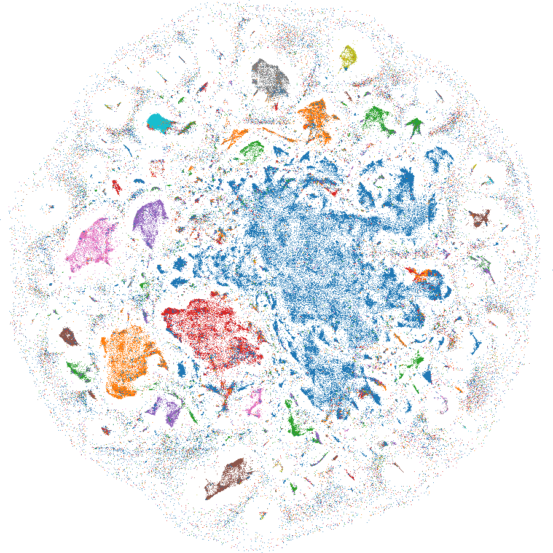
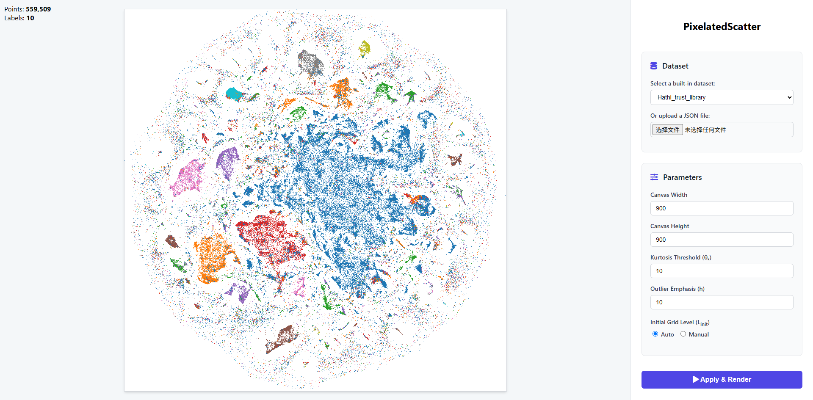

# PixelatedScatter

PixelatedScatter is a pixelated web-based visual abstraction tool for large-scale multiclass scatterplots, designed to provide better feature preservation across arbitrary abstraction levels for large-scale scatterplots, particularly in medium-to-low density regions.

##### For an Original scatterplot:




##### Ours results:



## How to Run

### Installation

1. **Clone the repository:**

   ```
   git clone https://github.com/Guozihengwww/PixelatedScatter-Arbitrary-level-Visual-Abstraction-for-Large-scale-Multiclass-Scatterplots
   cd .\PixelatedScatter-Arbitrary-level-Visual-Abstraction-for-Large-scale-Multiclass-Scatterplots\
   ```

2. **Install Flask:**

   ```
   pip install Flask
   ```

### Running the Application

1. **Start the Flask server:**

   ```
   python app.py
   ```

   You should see an output indicating that the server is running, typically on port 6010:

   ```
   * Running on http://127.0.0.1:6010
   ```

2. **Open in your browser:**
   Open your web browser and navigate to the address shown in the terminal:
   http://127.0.0.1:6010

The application should now be running in your browser.

**TIPS**: We recommend the monitor with 1920*1080 for the best effect.


## Usage Guide



You can interact with the visualization through the control panel on the right.

### Changing the Dataset

There are two ways to load data:

1. **Use a Built-in Dataset**: We provide a selection of 20 large-scale, multiclass scatterplot datasets. Simply choose one from the dropdown menu.

2. **Upload Your Own Data**: You can upload your own dataset by clicking the "Choose File" button. The file must be in JSON format and contain an array of objects. Each object **must have at least three attributes**: x, y, and label, all in number format.

   ```
   [
     {"x": 10.5, "y": 22.1, "label": 0},
     {"x": 12.1, "y": 25.3, "label": 1},
     ...
   ]
   ```

### Adjusting Parameters

You can fine-tune the rendering algorithm using the following parameters:

- **Canvas Width & Height**: These two controls define the resolution of the rendering canvas, which also serves as the abstraction level.
- **Kurtosis Threshold (θₖ)**: This parameter controls the granularity of the iso-density region partitioning. A **smaller** threshold leads to more fine-grained clusters, but may increase computation time and lose larger structural information. A typical range is 10-20.
- **Outlier Emphasis (h)**: This value adjusts the degree to which semantic outliers (rare categories next to a large number of other categories) are visually emphasized. A higher value allocates more pixels to these outlier classes.
- **Initial Grid Level (L<sub>init</sub>)**: This parameter helps preserve structural information, especially in sparse regions. It determines initial sizes of grids.
  - **Auto (Default)**: The application automatically calculates a reasonable value based on the canvas size. It is generally set to -1 for a 1000x1000 canvas and is adjusted accordingly for other resolutions.
  - **Manual**: You can set this value manually. A smaller value helps group dispersed points into coherent structures, which is useful for datasets with many sparse regions.  A larger value can better distinguish extremely dense regions.
